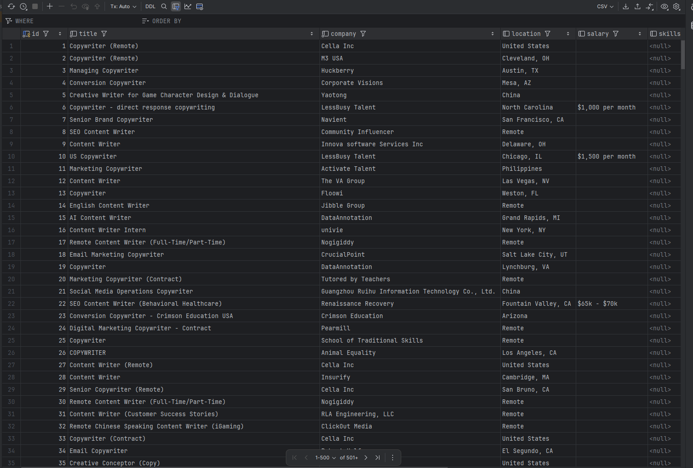
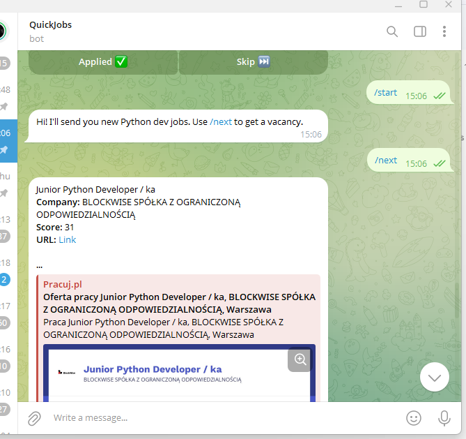
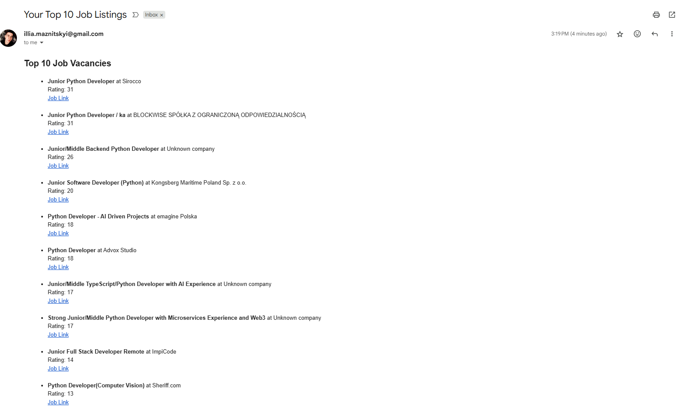
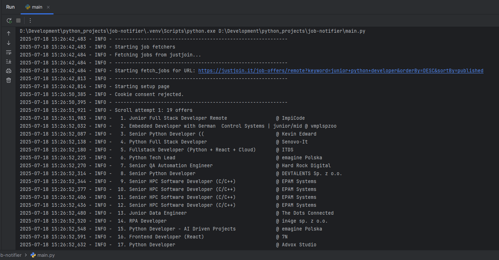

# Job Notifier


## Description
Sends recent, relevant job listings from top platforms via Telegram or email.


## Technologies Used
- Python
- Playwright
- Aiogram
- Smtplib
- Logging


## Features
- Fetches jobs from multiple platforms
- Sends filtered job listings via Telegram
- Emails top 10 jobs using SMTP


## Setup
To install the project locally on your computer, execute the following commands in a terminal:
```bash
git clone https://github.com/Illya-Maznitskiy/job-notifier.git
cd job-notifier
python -m venv venv
venv\Scripts\activate (on Windows)
source venv/bin/activate (on macOS)
pip install -r requirements.txt
```


# .env file
Create `.env` file in root by the [.env.sample](.env.sample).


# Setup keyword_weights.yaml
Create `keyword_weights.yaml` in the project root with content in lowercase, like this:

```yaml
positive:
  python: 5
  junior: 8
  remote: 4

negative:
  senior: -20
  javascript: -4
```


# Database
You can use your hosted PostgreSQL database or create one locally.

Local database script (Make sure PostgreSQL is installed):
```bash
psql -U postgres
CREATE DATABASE job_notifier;
```


## Tests
You can run flake8 linter using the following commands:
```bash
flake8
```


## Run the project
```bash
python -m main
```


## Run with Docker
Make sure Docker Desktop is running, this command builds the image and runs the job scraper in a container.
```
docker build -t job-notifier . ; docker run --rm job-notifier
```


## Screenshots
### Data


### Telegram Bot


### Email Sender


### Logging

